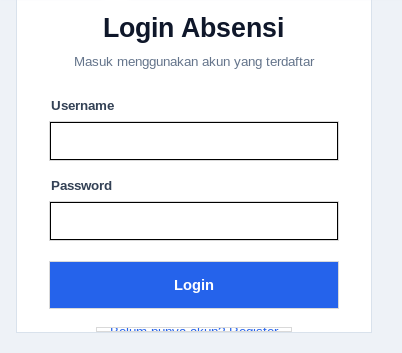
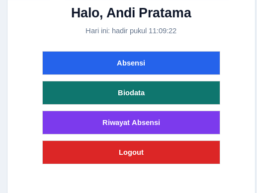
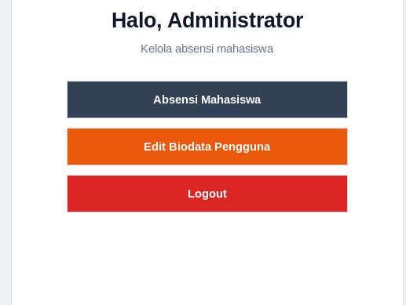

# Aplikasi Desktop Absensi

Repositori ini berisi dua versi aplikasi desktop Python berbasis Tkinter dan SQLite:

- `Pertemuan-1` untuk versi awal biodata statis
- `pertemuan-2` untuk versi yang lebih lengkap dengan login, register, biodata, absensi, dan riwayat

Versi yang paling relevan saat ini adalah `pertemuan-2`.

## Ringkasan Project

Project memakai pola MVC:

- `models/` untuk akses data dan logika database
- `views/` untuk tampilan Tkinter
- `controllers/` untuk navigasi dan alur aplikasi
- `databases/` untuk inisialisasi dan migrasi SQLite

## Struktur Folder

```text
Desktop/
├── Pertemuan-1/
│   ├── main.py
│   ├── test.py
│   ├── controllers/
│   ├── models/
│   ├── views/
│   └── databases/
├── pertemuan-2/
│   ├── main.py
│   ├── test.py
│   ├── controllers/
│   ├── models/
│   ├── views/
│   ├── databases/
│   └── AGENTS.md
└── README.md
```

## Versi 1: `Pertemuan-1`

Versi awal aplikasi hanya menampilkan biodata statis dari file model.

### Fitur

- Menampilkan biodata dalam kartu Tkinter
- Data diambil dari `models/biodata_model.py`
- Ada sanity check sederhana untuk Tkinter, SQLite, dan Pillow

### Entry point

- `Pertemuan-1/main.py`

### File utama

- `controllers/biodata_controller.py` untuk menghubungkan model dan view
- `models/biodata_model.py` untuk data biodata statis
- `views/biodata_view.py` untuk tampilan kartu biodata
- `databases/database.py` untuk inisialisasi database SQLite lokal
- `test.py` untuk pengecekan environment

## Versi 2: `pertemuan-2`

Ini adalah versi yang sedang aktif dikembangkan. Aplikasinya sudah memakai autentikasi dan data tersimpan di SQLite.

### Fitur saat ini

- Login pengguna
- Registrasi akun baru
- Dashboard berdasarkan role
- Lihat biodata pengguna login
- Edit biodata pengguna
- Absen masuk untuk mahasiswa
- Riwayat absensi per pengguna
- Validasi absensi mahasiswa oleh admin

### Role pengguna

- `admin`
- `mahasiswa`

### Entry point

- `pertemuan-2/main.py`

### File utama

- `controllers/biodata_controller.py` untuk navigasi dan session
- `models/user_model.py` untuk login, register, dan biodata
- `models/absensi_model.py` untuk operasi absensi
- `views/login_view.py` untuk halaman login
- `views/register_view.py` untuk halaman registrasi
- `views/dashboard_view.py` untuk dashboard utama
- `views/biodata_db_view.py` untuk tampilan biodata pengguna login
- `views/edit_biodata_view.py` untuk edit biodata
- `views/absensi_view.py` untuk absen mahasiswa
- `views/riwayat_view.py` untuk riwayat absensi
- `views/absensi_admin_view.py` untuk rekap absensi mahasiswa
- `views/edit_absensi_view.py` untuk validasi absensi oleh admin
- `databases/database.py` untuk inisialisasi dan migrasi database

## Database

Database SQLite bernama `absensi.db` dibuat di folder masing-masing project saat aplikasi dijalankan.

Skema utama di `pertemuan-2`:

- `users`
- `absensi`

Catatan:

- Password default disimpan dalam bentuk hash PBKDF2 untuk data seed baru.
- Data lama yang masih plaintext akan dimigrasi saat login.
- Fitur `jam_pulang` masih tersedia di skema, tetapi alurnya belum dipakai di UI sekarang.

## Cara Menjalankan

### 1. Versi `Pertemuan-1`

```bash
cd Pertemuan-1
python databases/database.py
python main.py
```

### 2. Versi `pertemuan-2`

```bash
cd pertemuan-2
python databases/database.py
python main.py
```

### Sanity check

```bash
python test.py
```

Jalankan perintah di atas dari folder project yang ingin diuji.

## Dependensi

Untuk menjalankan aplikasi:

- Python 3
- Tkinter
- SQLite3

Untuk sanity check `test.py`:

- Pillow (`pip install pillow`)

## Akun Demo

Setelah menjalankan `pertemuan-2/databases/database.py`, akun default yang tersedia adalah:

| Username | Password | Role |
| --- | --- | --- |
| `admin` | `123456` | `admin` |
| `mahasiswa1` | `123456` | `mahasiswa` |
| `mahasiswa2` | `123456` | `mahasiswa` |

## Dokumentasi Tampilan

Screenshot aplikasi disimpan di `pertemuan-2/Documents/`:

### Login



### Dashboard Mahasiswa



### Dashboard Admin



## Troubleshooting

| Masalah | Solusi |
| --- | --- |
| `ModuleNotFoundError: No module named 'PIL'` | Jalankan `pip install pillow` |
| `ModuleNotFoundError: No module named 'tkinter'` | Instal Tkinter sesuai sistem operasi |
| Database tidak terbaca | Pastikan menjalankan perintah dari folder project yang benar |
| `Database is locked` | Tutup proses lain yang masih memakai `absensi.db` |

## Catatan Implementasi

- Aplikasi `pertemuan-2` masih memakai nama `BioDataController`, tetapi fungsinya sekarang adalah controller utama untuk login dan navigasi.
- Akses admin dibatasi untuk halaman rekap absensi dan edit biodata pengguna.
- Data biodata mengikuti user yang sedang login, bukan biodata statis seperti versi pertama.
